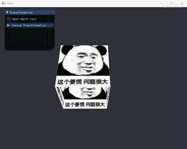
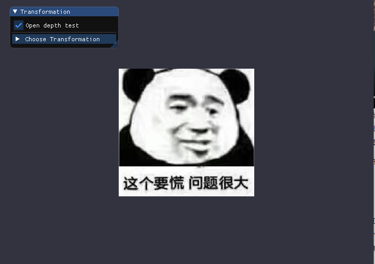
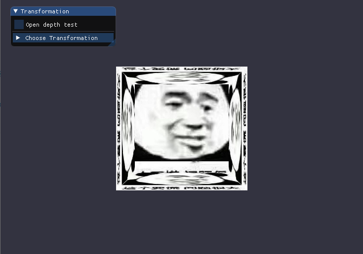
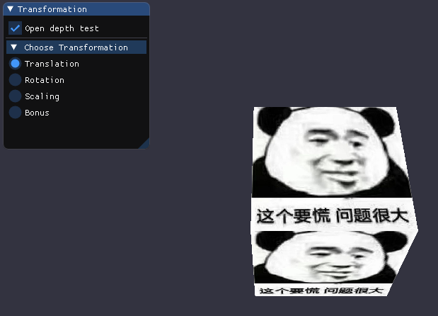
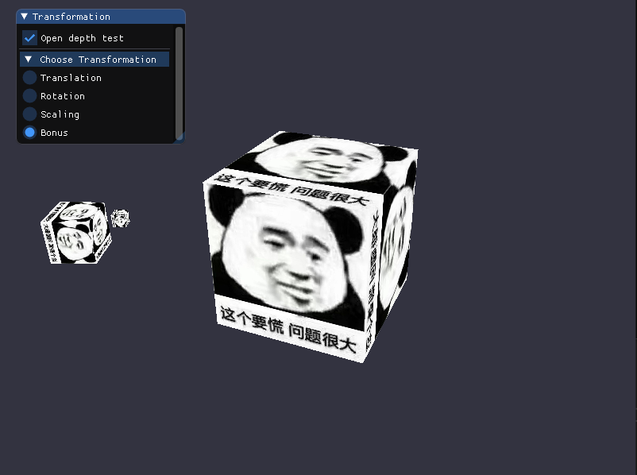
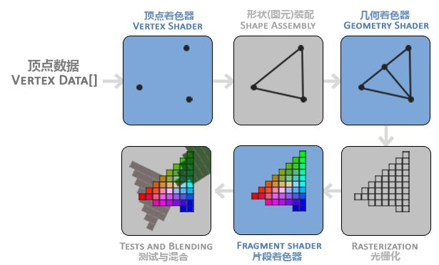

# Project4 Transformation

项目源码：[Github](https://github.com/T-Machine/Computer-Graphic)

## 实现内容

- 画一个立方体(cube)：边长为4， 中心位置为(0, 0, 0)。分别启动和关闭深度测试 `glEnable(GL_DEPTH_TEST) `、 `glDisable(GL_DEPTH_TEST) `，查看区别，并分析原因。 
- 平移(Translation)：使画好的cube沿着水平或垂直方向来回移动。 
-  旋转(Rotation)：使画好的cube沿着XoZ平面的x=z轴持续旋转。
- 放缩(Scaling)：使画好的cube持续放大缩小。 
- 在GUI里添加菜单栏，可以选择各种变换。
-  结合Shader谈谈对渲染管线的理解
- 将以上三种变换相结合，打开你们的脑洞，实现有创意的动画。比如：地球绕太阳转等。 




## 实现原理

我们定义的三维空间的顶点在最终显示在屏幕上之前，需要经过多个坐标空间的转换：

- 局部空间：指物体所在的坐标空间，是相对与物体自身而言的，用于定义初始的顶点坐标。
- 世界空间：是比局部空间更大的坐标空间，用于定义物体在整个“世界”中的位置和形态。
- 观察空间：是指观察者在观察这个世界空间时其视野前方的坐标空间，可以理解为摄像机镜头所显示的范围。
- 裁剪空间：即将观察空间的坐标限制在一个特定的范围内，将其余的坐标裁剪掉。这一变换过程通过一个平截头体来实现，只有落在平截头体中的坐标才会最终在屏幕上显示出来。
- 屏幕空间：即显示到屏幕上的2D坐标。

将坐标从一个空间变换到另一个空间是通过变换矩阵来实现的：

- Model矩阵：从局部空间到世界空间。定义了物体的位移、缩放、旋转，改变物体的位置、形态、朝向。
- View矩阵：从世界空间到观察空间。通过对整个场景进行变换来改变其在观察者视野中的状态。
- Projection矩阵：从观察空间到裁剪空间。投影矩阵定义了平截头体来对坐标空间进行裁剪，该矩阵分为正射投影和透视投影两种。正射投影定义的平截头体是立方体的

通过将定义的局部空间顶点坐标连续乘以这三个矩阵就能转换到裁剪空间：

$V_{clip}  = M_{projection} ⋅ M_{view} ⋅M_{model} ⋅ V_{local}$

最终OpenGL会将裁剪空间坐标转换为标准化设备坐标并映射到屏幕空间，在2D屏幕上显示出3D的图形。


## 实现过程

### 设定顶点

由于一个矩形由两个三角形组成，一个立方体共六个矩形面，故在三维空间中创建一个立方体共需要36个顶点。首先用float数组vertices来存放顶点的数据，包括三个坐标值，为了更好地体现三维特点，这里给立方体表面加上纹理图片，故数据中还包括纹理坐标信息。为使其边长为4， 中心位置为(0, 0, 0)，这里将每个顶点的每个坐标绝对值都设为2.0f：

```c++
float vertices[180] = {
	-2.0f, -2.0f, -2.0f,  0.0f, 0.0f,
	 2.0f, -2.0f, -2.0f,  1.0f, 0.0f,
	 2.0f,  2.0f, -2.0f,  1.0f, 1.0f,
	 2.0f,  2.0f, -2.0f,  1.0f, 1.0f,
	-2.0f,  2.0f, -2.0f,  0.0f, 1.0f,
	-2.0f, -2.0f, -2.0f,  0.0f, 0.0f,
	......
};
```


### 绘制立方体

创建VAO和VBO并绑定：

```c++
//创建VAO
unsigned int VAO;
glGenVertexArrays(1, &VAO);
glBindVertexArray(VAO);

//创建VBO存储顶点数据
unsigned int VBO;
glGenBuffers(1, &VBO);
glBindBuffer(GL_ARRAY_BUFFER, VBO);
```

将设置好的顶点数据复制到VBO中，并指定各项数据所对应的顶点属性。数据共分36组，每组5个数据，前三个为空间坐标，后两个为纹理坐标：

```c++
//将顶点数据复制到缓存
glBufferData(GL_ARRAY_BUFFER, sizeof(vertices), vertices, GL_STATIC_DRAW);
//位置属性
glVertexAttribPointer(0, 3, GL_FLOAT, GL_FALSE, 5 * sizeof(float), (void*)0);
glEnableVertexAttribArray(0);
//纹理属性
glVertexAttribPointer(1, 2, GL_FLOAT, GL_FALSE, 5 * sizeof(float), (void*)(3 * sizeof(float)));
glEnableVertexAttribArray(1);
```

#### 使用GLM创建变换矩阵

这里要用到的变换矩阵有：

- model：用于物体本身的各种变换
- view：用于观察视角的变换
- projection：用于产生透视投影

首先用glm初始化这三个单位矩阵：

```c++
glm::mat4 model = glm::mat4(1.0f);
glm::mat4 view = glm::mat4(1.0f);
glm::mat4 projection = glm::mat4(1.0f);
```

通过定义view矩阵来变换观察视角，即镜头的位置。为了使整个场景拉远，需要让所有顶点沿着Z轴的负方向平移，使用`glm::translate`实现。

然后用`glm::perspective`定义projection矩阵，将第一个参数（FOV）设为45.0f以获得较真实的观察效果。将平截头体的近和远平面分别设为0.1f和100.0f：

```c++
view = glm::translate(view, glm::vec3(0.0f, 0.0f, -15.0f));
projection = glm::perspective(glm::radians(45.0f), (float)SCREEN_W / (float)SCREEN_H, 0.1f, 100.0f);
```

#### 将变换矩阵传入着色器

为了应用变换矩阵，我们需要将它们传入顶点着色器中，让它们与各顶点的坐标相乘，这可以通过uniform实现，首先定义顶点着色器：

```c++
#version 330 core
layout (location = 0) in vec3 aPos;
layout (location = 1) in vec2 aTexCoord;
out vec2 TexCoord;
uniform mat4 model;
uniform mat4 view;
uniform mat4 projection;
void main()
{
	gl_Position = projection * view * model * vec4(aPos, 1.0f);
	TexCoord = aTexCoord;
}
```

然后使用`glGetUniformLocation`获取各个矩阵值在着色器中的对应位置，再以此将各个矩阵通过`glUniformMatrix4fv`传入着色器中：

```c++
glUniformMatrix4fv(glGetUniformLocation(myShader.ID, "model"), 1, GL_FALSE, model);
glUniformMatrix4fv(glGetUniformLocation(myShader.ID, "view"), 1, GL_FALSE, view);
glUniformMatrix4fv(glGetUniformLocation(myShader.ID, "projection"), 1, GL_FALSE, projection);
```

这样顶点着色器输出的顶点坐标就是已经使用模型、观察和投影矩阵进行变换后的坐标了。调用`glDrawArrays()`即可绘制所有顶点，将立方体显示在窗口上：

```c++
glDrawArrays(GL_TRIANGLES, 0, 36);
```

#### 深度测试

使用`glEnable(GL_DEPTH_TEST);`可以开启OpenGL的深度测试，使用`glDisable(GL_DEPTH_TEST);`可以将其关闭，两者的效果分别如下：

  开启：



关闭：



可以看到，当开启深度测试时，显示出来的正方体符合正常透视效果的，即只看得见最前面的面。而关闭深度测试后原本应该被遮住的侧面会被绘制到其他面上方。这一差异与OpenGL存储深度信息的方式有关，OpenGL存储它的所有深度信息于一个Z-buffer中，每个片段都会有深度值，当某个片段准备输出其颜色到某个像素时，OpenGL会将其深度值与Z-buffer中对应像素的深度值比较，如果要输出的片段在“前面”，则会覆盖掉该像素的颜色，否则该输出会被丢弃。因此在开启深度测试后，在各像素上显示出的颜色由深度决定，而关闭深度测试后，各像素的颜色由顶点绘制的顺序决定，从而显示出了上图中的效果。


### 三种变换

#### GUI菜单

使用`ImGui::CollapsingHeader`和`ImGui::RadioButton`创建下拉选项，用一个CheckBox来控制是否开启深度测试：

```c++
ImGui::Checkbox("Open depth test", &isTestDepth);
ImGui::Separator();
	
if(ImGui::CollapsingHeader("Choose Transformation")) {
	ImGui::RadioButton("Translation", &show_what, 0);
	ImGui::RadioButton("Rotation", &show_what, 1);
	ImGui::RadioButton("Scaling", &show_what, 2);
	ImGui::RadioButton("Bonus", &show_what, 3);
}
```



#### 平移Translation

实现连续变换的方法是在每次渲染循环时都改变model矩阵的值，使得每次渲染出的画面都不一样。为了获取不同的数值，可以利用`glfwGetTime()` 方法，该方法会返回GLFW初始化后经历的时间，因此该值是单调递增的。

为了实现来回平移的效果，需要将单调递增的时间值转换为一个能来回变化的值，这里可以利用三角函数来实现：

```c++
float getTime = (float)glfwGetTime();
float translateValue = sin(getTime);
model = glm::translate(model, glm::vec3(translateValue, 0.0f, 0.0f));
```

通过再次调用`glm::translate`就能将新的变换叠加到原来的model上，将第二个向量参数的x值设为三角函数值就能让立方体在水平方向来回移动。

#### 旋转Rotation

旋转变换利用的是`glm::rotate`方法，其第二个参数指定了旋转的角度，第三个参数指定旋转的轴。为了使立方体持续旋转，可以直接将角度值设为`glfwGetTime()`的返回值。通过将第三个向量参数的X和Z元素值设为1，Y元素设为0，就能让立方体绕 x = z 轴旋转：

```c++
model = glm::rotate(model, getTime, glm::vec3(1.0f, 0.0f, 1.0f));
```

#### 放缩Scaling

缩放变换使用`glm::scale`方法，其第二个参数指定各个维度缩放比例。为了持续放大缩小，这里同样利用三角函数加时间值，将三个维度都设为同一个值以进行等比例缩放，为了保持正值这里取了绝对值并加了一个下限。

```c++
float scaleValue = abs(sin(getTime)) + 0.2f;
model = glm::rotate(model, 1.0f, glm::vec3(0.0f, 1.0f, 1.0f)); //调整视角
model = glm::scale(model, glm::vec3(scaleValue, scaleValue, scaleValue));
```


### Bonus 三种变换相结合

这里实现了一个太阳、地球、月亮一起转动的效果。其中太阳保持自转，地球绕着中间的太阳转并保持自转，月球围绕地球转，最终效果如下：



为了绘制多个同样的立方体，需要多次调用`glDrawArrays(GL_TRIANGLES, 0, 36);`，可以通过循环来实现。每次循环中分别改变model矩阵的值即可使每个立方体呈现不同的变换。

对于第一个立方体（太阳），用`glm::scale`进行适当缩放，并用`glm::rotate`使其保持转动。

对于第二个立方体（地球），用`glm::translate`使其绕太阳转动，根据三角函数的图像特点可知，当x = sin(t), y = cos(t)时，(x, y)的轨迹就是一个圆形，利用这一点将`glm::translate`的第二个向量参数的X和Y值分别设为sin(getTime)和cos(getTime)即可沿圆周进行移动，其圆心是translate之前model对应的中心点，也就是太阳的圆心。

对于第三个立方体（月球），使用同样的方法令其绕第二个立方体运动。由于设置第二个立方体时使用了`glm::translate`，改变了中心点位置，故再次进行translate时是基于上次变换后的结果的，因此再次定义圆周圆周运动时，其圆心会变为第二个立方体的中心点位置。

```c++
if (show_what == 3) {
	for (unsigned int i = 0; i < 3; i++) {
		if (i == 0) {
			model = glm::scale(model, glm::vec3(0.8f, 0.8f, 0.8f));
			model = glm::rotate(model, getTime / 3, glm::vec3(0.0f, 1.0f, 0.0f));
		}
		else if (i == 1) { 
			model = glm::translate(model, glm::vec3(sin(getTime)*1.6, 0.0f, cos(getTime)*1.5));
			model = glm::scale(model, glm::vec3(0.3f, 0.3f, 0.3f));
			model = glm::rotate(model, getTime, glm::vec3(0.0f, 1.0f, 0.0f));
		}
		else if (i == 2) {
			model = glm::translate(model, glm::vec3(sin(getTime*2)*1.0, 0.0f, cos(getTime*2)*1.0));
			model = glm::scale(model, glm::vec3(0.3f, 0.3f, 0.3f));
		}
		myShader.setMat4("model", model);
		glDrawArrays(GL_TRIANGLES, 0, 36);
	}
}
else {
	glDrawArrays(GL_TRIANGLES, 0, 36);
}
```


### 结合Shader谈谈对渲染管线的理解 

渲染管线是用于将3D坐标转换为屏幕上的2D像素的处理单元。渲染管线的处理分为多个阶段，每个阶段都会以上一个阶段的输出作为输入，因此各个阶段都可以用一个小程序来实现，这些小程序就是Shader。

渲染管线的工作流程大致如下：



其中顶点着色器将输入的顶点数据中的坐标信息转换为标准化设备坐标。

图元装配阶段则是将顶点着色器输出的顶点装配成指定的图形，比如图中将三个顶点装配成三角形。

几何着色器则接收图元装配阶段的输出，通过产生新的顶点来创建新的图元。

之后的光栅化阶段将图元映射为屏幕上的像素，生成片段。

片段着色器则根据输入的片段来计算像素最终显示的颜色。

开发者可以自行编写Shader来更精确地控制渲染管线处理过程中的某个阶段。比如用GLSL来编写OpenGL中的Shader。因为GPU中没有默认的顶点着色器和片段着色器，所以在使用OpenGL时需要自行定义。

