# Project5 Camera

## 实现内容

#### Basic：

- 投影(Projection):
  - 把上次作业绘制的cube放置在(-1.5, 0.5, -1.5)位置，要求6个面颜色不一致 。
  - 正交投影(orthographic projection)：实现正交投影，使用多组(left, right, bottom, top, near, far)参数，比较结果差异 。
  - 透视投影(perspective projection)：实现透视投影，使用多组参数，比较结果差异 。
- 视角变换(View Changing): 
  - 把cube放置在(0, 0, 0)处，做透视投影，使摄像机围绕cube旋转，并且时刻看着cube中心 。
- 在GUI里添加菜单栏，可以选择各种功能。
- 在现实生活中，我们一般将摄像机摆放的空间View matrix和被拍摄的物体摆设的空间Model matrix分开，但 是在OpenGL中却将两个合二为一设为ModelView matrix，通过上面的作业启发，你认为是为什么呢？在报 告中写入。（Hints：你可能有不止一个摄像机）

#### Bonus：

- 实现一个camera类，当键盘输入 w,a,s,d ，能够前后左右移动；当移动鼠标，能够视角移动("look around")， 即类似FPS(First Person Shooting)的游戏场景 。


## 实现结果

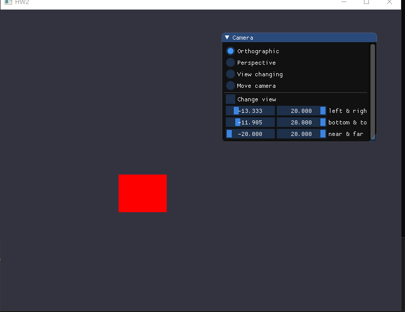

不同参数的正交投影：

| 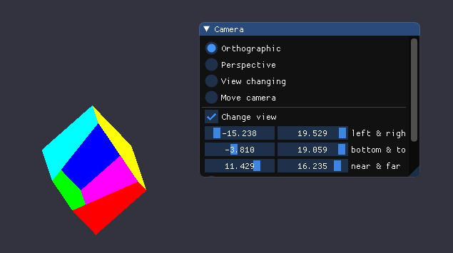 | 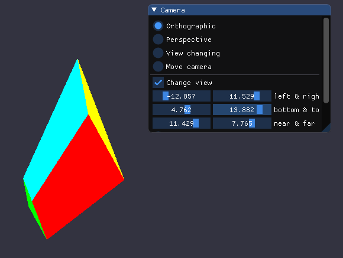 |
| ------------------------------------------ | ------------------------------------------ |
| 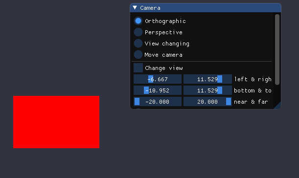 | 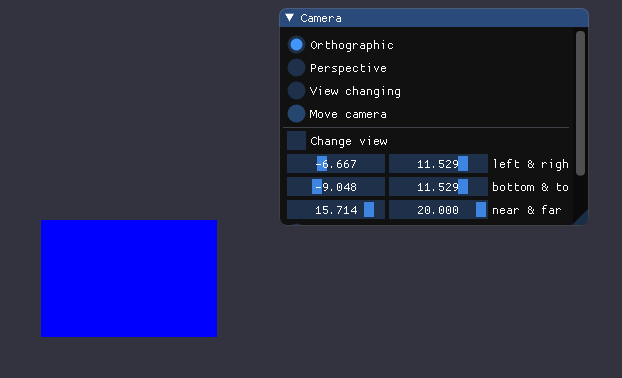 |

可以看到当改变了left, right, bottom, top这四个参数时，立方体会在相应的方向上被拉伸或压缩，而当改变near和far两个参数时，立方体会在Z轴方向被截取一部分。


不同参数的透视投影：

| 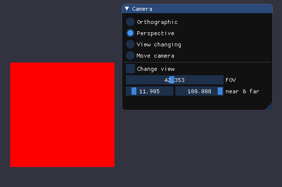 | 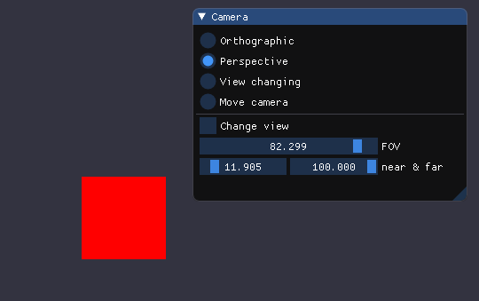 |
| ------------------------------------------ | ------------------------------------------ |
| 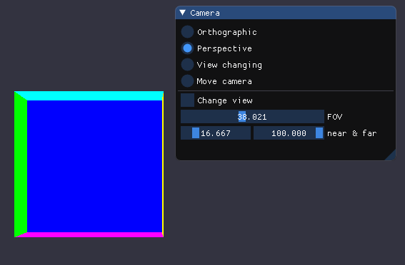 | 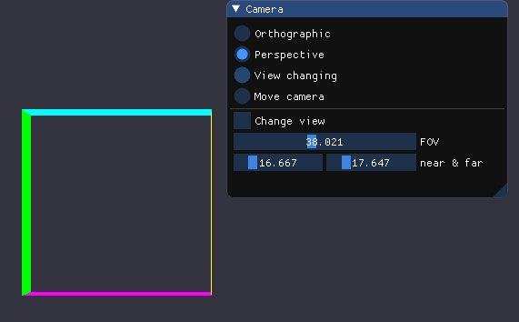 |

可以看到当第一个参数FOV增大时，视野范围会增大，投影出来的立方体相对就会变小。当调节near和far参数时，立方体会在Z轴方向被截取一部分。


摄像机自动旋转：

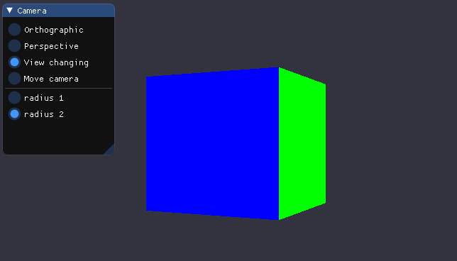

键盘和鼠标控制相机：

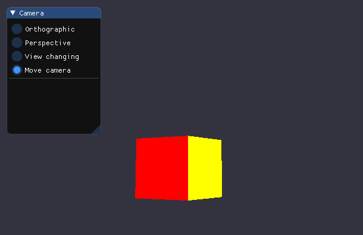


## 实现原理

在OpenGL中，通过将场景内的所有物体反向移动，可以实现摄像机移动的效果。

为了定义一个摄像机，需要有四个重要的信息：摄像机的位置、摄像机观察的方向、一个指向摄像机右侧的向量、一个指向摄像机上方的向量。这些信息实际上是构建了一个以摄像机所处位置为原点的坐标系。

相机的方向向量可以通过让位置向量于目标点的位置向量做差得到。右向量可以通过定义一个上向量来和方向向量作叉乘得到。

有了目标向量、右向量和上向量后就可以创建一个LookAt矩阵，用这个矩阵乘以任何向量就能将其变换到摄像机的坐标空间，创建的方法如下：

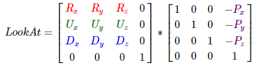

GLM提供了`lookAt()`方法用于创建该矩阵。


## 实现过程

### GUI菜单：

使用一组`ImGui::RadioButton`来选择显示的内容，并用Slider来调节不同的参数：

```c++
ImGui::Begin("Camera");
ImGui::RadioButton("Orthographic", &show_what, 0);
ImGui::RadioButton("Perspective", &show_what, 1);
ImGui::RadioButton("View changing", &show_what, 2);
ImGui::RadioButton("Move camera", &show_what, 3);
ImGui::Separator();
if (show_what == 0) {
	ImGui::Checkbox("Change view", &changeView);
	ImGui::SliderFloat2("left & right", ortho_left_right, -20.0f, 20.0f);
	ImGui::SliderFloat2("bottom & top", ortho_bottom_top, -20.0f, 20.0f);
	ImGui::SliderFloat2("near & far", ortho_near_far, -20.0f, 20.0f);
}
if (show_what == 1) {
	ImGui::Checkbox("Change view", &changeView);
	ImGui::SliderFloat("FOV", &pers_fov, 0.0f, 90.0f);
	ImGui::SliderFloat2("near & far", pers_near_far, 0.0f, 100.0f);
}
else if (show_what == 2) {
	ImGui::RadioButton("radius 1", &parameter, 0);
	ImGui::RadioButton("radius 2", &parameter, 1);
}
else if (show_what == 3) {
	//捕获鼠标
	glfwSetInputMode(window, GLFW_CURSOR, GLFW_CURSOR_DISABLED);
}
ImGui::End();
```

当选择自由移动Camera的选项时开启光标捕获。


### 两种投影：

正交投影使用的方法为`glm::ortho`，其六个参数分别为平截头箱的left, right, bottom, top, near, far六个面的位置：

```c++
projection = glm::ortho(ortho_left_right[0], ortho_left_right[1], ortho_bottom_top[0], ortho_bottom_top[1], ortho_near_far[0], ortho_near_far[1]);
```

透视投影使用的方法为`glm::perspective`，其第一个参数为平截头体的FOV，即视野大小；第二个参数为其宽高比；最后两个参数分别为近面和远面的位置。

```c++
projection = glm::perspective(glm::radians(pers_fov), (float)SCREEN_W / (float)SCREEN_H, pers_near_far[0], pers_near_far[1]);
```

将得到的projection矩阵通过uniform传入顶点着色器中用于计算乘积即可实现投影。


### 镜头围绕Cube旋转：

使镜头围绕Cube旋转需要定义`LookAt`矩阵，用于生成该矩阵的位置向量需要随着时间不断变化，且变换的轨迹是以Cube为圆心的圆，可以利用三角函数实现。目标向量和上向量需要保持不变，使得镜头一直对准Cube中心。然后将该矩阵作为变换视角的View矩阵即可：

```c++
projection = glm::perspective(glm::radians(45.0f), (float)SCREEN_W / (float)SCREEN_H, 0.1f, 100.0f);
r = parameter == 0 ? 10.0f : 15.0f;
float camPosX = sin(getTime) * r;
float camPosZ = cos(getTime) * r;
view = glm::lookAt(glm::vec3(camPosX, 0.0, camPosZ), glm::vec3(0.0, 0.0, 0.0), glm::vec3(0.0, 1.0, 0.0));
```


### Camera类的实现：

思路：定义Camera类主要是为了求得相机的`LookAt`矩阵。当获取了键盘或鼠标的输入时，相应地改变Camera对象中的位置向量和目标向量。然后在每个渲染循环中，都用这些向量计算一次`LookAt`矩阵，用于视角变换。

Camera类定义如下：

```c++
class Camera {
public:
	Camera(float zPos);
	glm::mat4 getCameraView();
	void moveForward(float speed);
	void moveBack(float speed);
	void moveRight(float speed);
	void moveLeft(float speed);
	void rotateCamera(float yaw, float pitch);
private:
	glm::mat4 cameraView;
	glm::vec3 cameraPos;
	glm::vec3 cameraFront;
	glm::vec3 cameraUp;
};
```

其中`cameraView`为相机的`lookAt`矩阵，`cameraPos`为相机的位置向量，`cameraFront`为相机的目标向量，`cameraUp`为上向量。该Camera的作用就是通过这三个向量计算出`LookAt`矩阵，通过`getCameraView()`方法返回给渲染函数，将其作为用于变换观察视角的View矩阵，使得观察到的内容与摄像机的视野相同。

此外`moveForward(float speed)`, `moveBack(float speed)`, `moveRight(float speed)`, `moveLeft(float speed)`是用来调整相机位置的方法，分别对应前后左右四个方向，参数为相机的移动速度。

对于前后移动，只需要将`cameraPos`向量加上或减去`cameraFront`即可，即当前位置在当前朝向的方向上加上或减轻一定的值：

```c++
void Camera::moveForward(float speed) {
	cameraPos += cameraFront * speed;
}
void Camera::moveBack(float speed) {
	cameraPos -= cameraFront * speed;
}
```

对于左右平移，需要先将`cameraUp`与`cameraFront`进行叉乘来创建一个右向量，再用`cameraPos`加上或减去这个右向量即可得到新的位置向量：

```c++
void Camera::moveRight(float speed) {
	cameraPos += glm::normalize(glm::cross(cameraFront, cameraUp)) * speed;
}
void Camera::moveLeft(float speed) {
	cameraPos -= glm::normalize(glm::cross(cameraFront, cameraUp)) * speed;
}
```

`rotateCamera(float yaw, float pitch)`方法用于控制相机的视角转动，参数中的`yaw`为偏航角，`pitch`为俯仰角。利用这两个角度以及三角函数规律就可以计算出新的目标向量，使得相机镜头朝向新的位置：

```c++
void Camera::rotateCamera(float yaw, float pitch) {
	glm::vec3 front;
	front.x = cos(glm::radians(pitch)) * cos(glm::radians(yaw));
	front.y = sin(glm::radians(pitch));
	front.z = cos(glm::radians(pitch)) * sin(glm::radians(yaw));
	cameraFront = glm::normalize(front);
}
```

每次调用`getCameraView()`时都要重新计算`LookAt`矩阵：

```c++
cameraView = glm::lookAt(cameraPos, cameraPos + cameraFront, cameraUp);
```

这样Camera的类就实现完了，接下来需要获取键盘的输入以及鼠标的移动来控制Camera。


键盘输入可以通过`processInput(GLFWwindow *window)`方法来获取，利用`glfwGetKey(window, GLFW_KEY_XXX)`来判断按了哪个键，然后调用Camera相应的移动函数，比如按W前进：

```c++
if (glfwGetKey(window, GLFW_KEY_W) == GLFW_PRESS)
	camera->moveForward(speed);
```

而鼠标的输入则需要通过回调方法`mouse_callback(GLFWwindow* window, double xpos, double ypos)`来获取。使用该回调需要先在GLFW中注册：

```c++
glfwSetCursorPosCallback(window, mouse_callback);
```

当鼠标移动时，该回调函数就会触发，其参数中的`xpos`和`ypos`就是当前光标在窗口中的位置，我们需要保存上一次的光标位置，然后当获取新的位置时，通过与旧的位置做差来得到便宜量。将俯仰角和偏航角加上偏移量就能得到新的角度值，传入Camera中用于更新`cameraFront`向量：

```c++
void mouse_callback(GLFWwindow* window, double xpos, double ypos) {
    yaw += (xpos - last_mouseX) * 0.05;
	pitch += (last_mouseY - ypos) * 0.05;
	pitch = pitch > 89.0f ? 89.0f : pitch;
	pitch = pitch < -89.0f ? -89.0f : pitch;
	//俯仰角需要限制在-90°到+90°之间
	last_mouseX = xpos;
	last_mouseY = ypos;
	camera->rotateCamera(yaw, pitch);
}
```

此外，在获取输入前需要开启GLFW捕获鼠标的功能：

```c++
glfwSetInputMode(window, GLFW_CURSOR, GLFW_CURSOR_DISABLED);
```

 

因为开启鼠标捕获以后就看不到光标了，所以这里实现了一个按Q键退出自由Camera模式的功能，同样使用`glfwSetInputMode`来取消鼠标捕获：

```c++
void ProjectCamera::changeShowWhat() {
	//取消鼠标捕获
	glfwSetInputMode(window, GLFW_CURSOR, GLFW_CURSOR_NORMAL);
	show_what = 2;
}
```

```c++
if (glfwGetKey(window, GLFW_KEY_Q) == GLFW_PRESS)
	((ProjectCamera*)project)->changeShowWhat();
```


### 关于摄像机的ModelView matrix

在现实生活中，我们一般将摄像机摆放的空间View matrix和被拍摄的物体摆设的空间Model matrix分开，但是在OpenGL中却将两个合二为一设为ModelView matrix。

这么做可以更方便地定义摄像机在整个场景中的位置，从而得到位置向量，并且可以结合其他物体的位置计算出方向向量。由此求出摄像机LookAt矩阵，进行视角变换。此外当场景中有不止一个摄像机时，这样的方法也能够方便地处理它们各自的视角，得到多个投影画面。