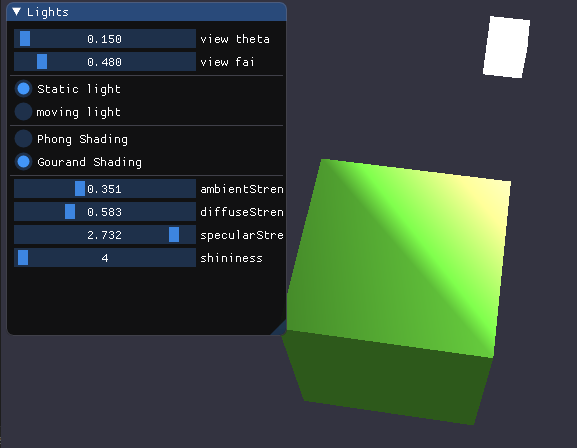

# Project6 Lighting

源代码地址：<https://github.com/T-Machine/Computer-Graphic>

## 实现内容

### Basic：

1. 实现Phong光照模型： 
   - 场景中绘制一个cube 
   - 自己写shader实现两种shading: Phong Shading 和 Gouraud Shading，并解释两种shading的实现原理 
   - 合理设置视点、光照位置、光照颜色等参数，使光照效果明显显示
2.  使用GUI，使参数可调节，效果实时更改： 
   - GUI里可以切换两种shading
   - 使用如进度条这样的控件，使ambient因子、diffuse因子、specular因子、反光度等参数可调节，光照效 果实时更改 

### Bonus：

当前光源为静止状态，尝试使光源在场景中来回移动，光照效果实时更改。 

## 实现结果

gif演示：


改变多组影响因子，两者光照模型的渲染结果对比：

| Phong Shading                                | Phong Shading                                |
| -------------------------------------------- | -------------------------------------------- |
|  |  |
| Gouraud Shading                              | Gouraud Shading                              |
|  |  |


## 实现原理

### Phong 光照模型

冯氏光照模型的主要结构由三个分量组成：

- **环境光照**：现实中即使物体处于黑暗环境下，也会受到一些环境光的影响，导致其不会完全黑暗，Phong光照模型中通过永久给物体一个颜色来模拟这种环境光。
- **漫反射光照**：物体的某部分与光照方向之间的夹角越小，它就会越亮。冯氏模型根据光源与物体之间的位置关系来模拟光源对物体的方向性影响，是该光照模型中视觉效果最显著的部分。
- **镜面光照**：当以一定视角观察物体时，可能会看见物体表面反射的高光，冯氏模型则可以模拟光泽物体表面上出现的这种亮点，这些亮点会较接近于光的颜色。

#### 环境光照Ambient Lighting

光源除了直接照射到物体上外，可能会通过在环境中的反射，最终间接照射到物体上。考虑了这种环境光照的方法叫全局光照算法，但是这样的算法开销会很大，因此冯氏模型使用了一个简化的方法，即永久性地在物体上加上一个较小的光照效果，使其具有一定颜色，这个效果是一个常量，并且对物体的每个片段均起作用。

在片段着色器中，首先用光的颜色乘以一个较小的常量环境因子，得到环境光，在将该值乘上物体的颜色，就得到了物体在该环境光影响下的颜色，将它作为片段着色器的输出颜色即可在OpenGL中显示出来。

#### 漫反射光照Diffuse Lighting

漫反射光照主要是要使物体上与光线方向越接近的片段能够从光源处获得更多的亮度。因此需要知道各片段和光照之间的位置和方向关系。为了得到光线和片段的角度，可以利用向量的夹角来表示，这就需要引入法向量的概念，即垂直于片段表面的向量。此外还需要有光线的方向，这可以通过将光源的位置与片段位置之间求向量差得到。得到了法向量和方向向量后即可将它们标准化然后求出夹角的余弦值。


在片段着色器中，将各顶点的位置向量乘上model矩阵即可得到顶点的世界空间坐标，将其与输入的光源位置向量做差即可得到光的方向向量`lightDir`。通过glsl中的`dot`方法可以将`lightDir`和法向量`normal`进行点乘，得到光源对当前片段实际的漫反射影响因子。将该因子乘上光的颜色就得到了漫反射分量。最后将该分量与物体颜色相乘得到漫反射光在物体上显示的颜色。

#### 镜面光照Specular Lighting

镜面反光同样依赖于光的方向以及物体的法向量，但它还要额外考虑观察的方向。如图：


计算镜面反射时首先要算出反射向量，然后计算反射向量和视线方向的角度差，该角度越小，镜面反射光的影响就越大，当影响足够大时就会看见高光亮点。

在片段着色器中，首先要获取顶点的世界空间坐标以及摄像机（观察者）的世界空间坐标，将两者做差并标准化求出视线向量`viewDir`。然后利用glsl中的`reflect`求出漫反射光照中的`lightDir`对应的反射向量。将反射向量与视线向量点乘并取其N次幂即可得到镜面反射影响因子，这里的N是物体的反光度（Shininess），即反光的能力。将该因子乘上光的颜色就得到镜面反射分量。将求出的三种分量相加再乘上物体的颜色就能得到最终要显示的颜色。

### Gouraud Shading

Phong Shading是将Phong光照模型在片段着色器中实现，根据每个片段的位置计算不同的颜色输出。而Gouraud Shading则是将Phong光照模型在顶点着色器中实现，即只计算各个顶点所对应的实际颜色，而片段的颜色则根据各顶点的颜色差值得到。

Gouraud Shading的好处是大大减小了计算开销，因为顶点的数量要比片段数量少得多，从而更高效。但是由于使用了差值进行计算，所以当顶点的数量较少时，计算出的光照效果会不真实，而Phong Shading则可以产生更平滑的光照效果。

## 实现过程

### 顶点着色器

在计算漫反射和镜面反射的过程中需要用到片段的法向量和位置信息，因此需要将这些数据经过顶点着色器的处理后作为输出传入到片段着色器中。

其中各个顶点的位置和法向量通过VBO读入顶点着色器中，对于位置信息，需要将其乘上model矩阵，以此得到片段在世界空间中的坐标；对于法向量信息，为了使法向量的方向免受不等比缩放的影响，需要乘上一个**法线矩阵**，即**model矩阵左上角的逆矩阵的转置矩阵**，利用glsl中的`transpose`和`inverse`方法实现：

```c++
#version 330 core
layout (location = 0) in vec3 aPos;
layout (location = 1) in vec3 aNormal;
out vec3 Normal;
out vec3 FragPos;
uniform mat4 model;
uniform mat4 view;
uniform mat4 projection;
void main()
{
	FragPos = vec3(model * vec4(aPos, 1.0));
    Normal = mat3(transpose(inverse(model))) * aNormal;
	gl_Position = projection * view * vec4(FragPos, 1.0f);
}
```


### 片段着色器

#### 环境光分量的计算

该分量为ambient因子乘上光的颜色，这两个数值都通过uniform传入到片段着色器中：

```c++
vec3 ambient = ambientStrength * lightColor;
```

#### 漫反射分量的计算

首先需要将法向量标准化，然后让光源位置向量和片段位置向量做差得到光线向量，将法向量和光线向量点乘并保证结果不小于0即可得到漫反射因子。将该因子乘上光的颜色以及一个由用户输入的漫反射力度因子，就得到了，漫反射分量：

```c++
vec3 norm = normalize(Normal);
vec3 lightDir = normalize(lightPos - FragPos);
float diff = max(dot(norm, lightDir), 0.0);
vec3 diffuse = diffuseStrength * diff * lightColor;
```

#### 镜面反射分量的计算

首先让摄像机位置向量和片段位置向量做差得到视线向量。然后利用glsl的`reflect`函数求出光线向量沿法线轴的反射向量，由于该函数的第一个参数是从光源指向片段位置的向量，以此需要对之前计算的光线向量取反。

将视线向量与反射向量作点乘，并确保其值不小于0，然后取其Shininess次幂，就得到了镜面反射的影响因子。

最后将该因子乘上用户输入的镜面强度(specularStrength)以及光的颜色就得到了镜面反射分量：

```c++
vec3 viewDir = normalize(viewPos - FragPos);
vec3 reflectDir = reflect(-lightDir, norm);
float spec = pow(max(dot(viewDir, reflectDir), 0.0), shininess);
vec3 specular = specularStrength * spec * lightColor;
```

最后需要将三个分量相加后乘上物体本身的颜色来得到片段着色器的输出：

```c++
vec3 result = (ambient + diffuse + specular) * objectColor;
FragColor = vec4(result, 1.0);
```


#### 渲染的过程

根据用户在GUI中选择的光照模型，使用不同的着色器，通过uniform将需要的矩阵和数据传入其中：

```c++
if (shading_mode == 0) {
	cubeShader.use();
	cubeShader.setFloat("ambientStrength", ambientStrength);
	......
}
else if (shading_mode == 1) {
	GourandShader.use();
	GourandShader.setFloat("ambientStrength", ambientStrength);
	......
}
glBindVertexArray(cubeVAO);
glDrawArrays(GL_TRIANGLES, 0, 36);
```

对于光源的渲染，使用另一套着色器并再次绑定VAO，然后调用`glDrawArrays`：

```c++
lightShader.use();
model = glm::translate(model, lightPos);
model = glm::scale(model, glm::vec3(0.2f, 0.2f, 0.2f));
lightShader.setMat4("model", model);
lightShader.setMat4("view", view);
lightShader.setMat4("projection", projection);
glBindVertexArray(lightVAO);
glDrawArrays(GL_TRIANGLES, 0, 36);
```


###  Gouraud Shading 的实现

由于Gouraud Shading是将Phong光照模型放到顶点着色器中实现，以此只要将三个光照分量的计算操作以及各数据的uniform输入都改为在顶点着色器中进行即可：

```c++
layout (location = 0) in vec3 aPos;
layout (location = 1) in vec3 aNormal;

out vec3 newColor;

uniform vec3 lightPos;
uniform vec3 viewPos;
......

void main()
{
    gl_Position = projection * view * model * vec4(aPos, 1.0);   
    vec3 VertexPos = vec3(model * vec4(aPos, 1.0));
    vec3 Normal = mat3(transpose(inverse(model))) * aNormal;
    vec3 ambient = ambientStrength * lightColor;  	 
    ......
    vec3 diffuse = diffuseStrength * diff * lightColor;
    .......
    vec3 specular = specularStrength * spec * lightColor;      

    newColor = (ambient + diffuse + specular) * objectColor;
}
```


### 移动的光源

在循环渲染的过程中，通过`glfwGetTime()`获取时间值，并用该值配合三角函数就能让光源的位置向量来回改变，然后将该向量通过uniform传入到着色器中就能实时更新计算结果：

```c++
float getTime = (float)glfwGetTime();
viewPos = glm::vec3(camPosX, camPosY, camPosZ);
if (show_what == 1) {
	lightPos = glm::vec3(sin(getTime) * lightRPos, lightYPos, cos(getTime) * lightRPos);
}
cubeShader.setVec3("lightPos", lightPos);
```

