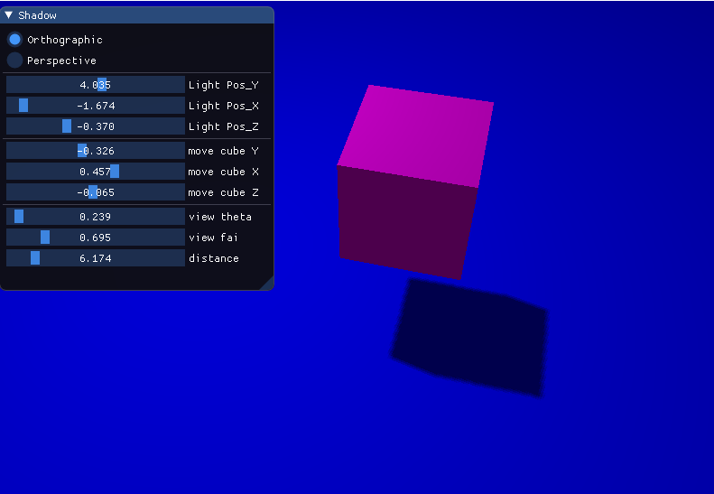
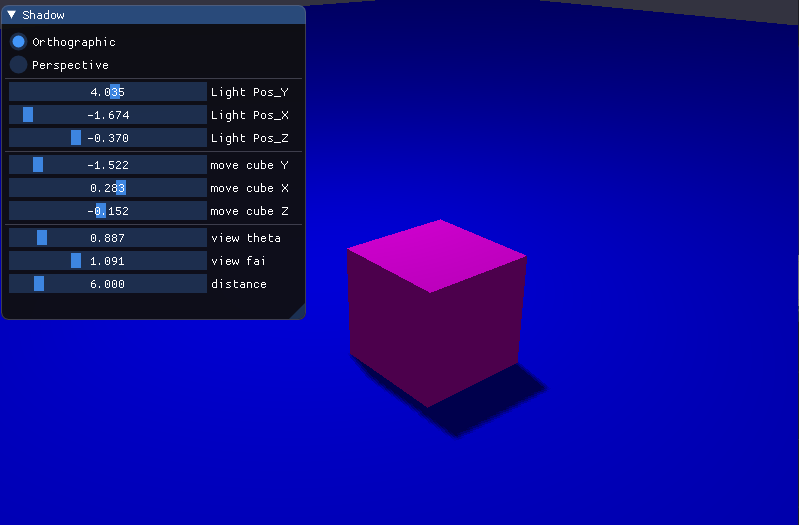
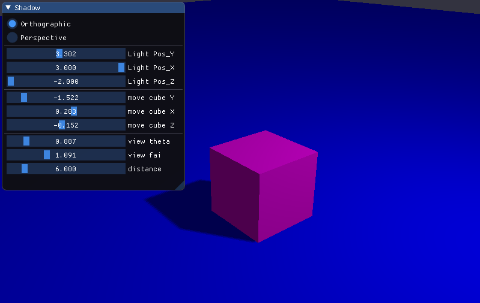
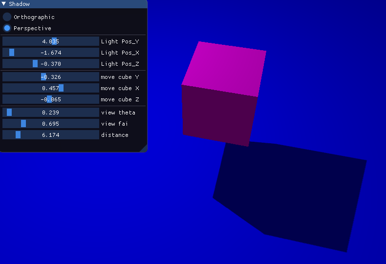
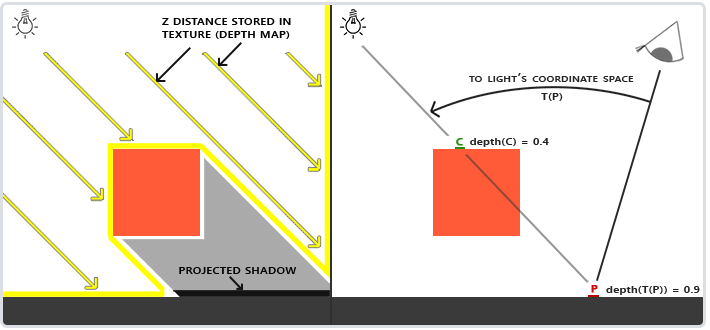
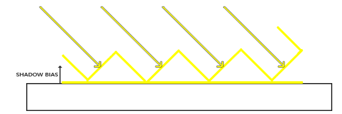
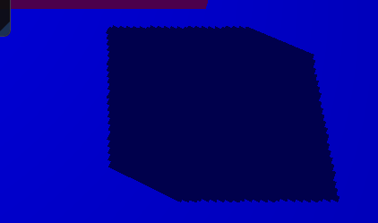
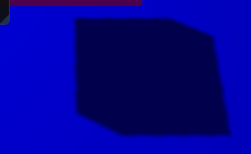

# Project7 Shadow

源代码地址：<https://github.com/T-Machine/Computer-Graphic>

## 实现内容

### Basic：

1.  实现方向光源的Shadowing Mapping:
   - 场景中有一个object和一个plane
2. GUI改变投影方式，以及光源位置、物体位置、摄像机视角等参数。

### Bonus：

1. 实现了光源在正交和透视两种投影下的Shadow Mapping
2. 实现了阴影锯齿消除的优化

## 实现效果

|                光源正交投影                |                改变物体位置                |
| :----------------------------------------: | :----------------------------------------: |
|  |  |
|                改变光源位置                |                光源透视投影                |
|  |  |

GIF：


## 实现原理

当光源的光线因其他的物体阻挡而不能到达另一个物体表面时，就会产生阴影。阴影映射(Shadow Mapping)的主要思路就是找到光线照射到的第一个物体，从而确定光线照不到的部分，如下图所示：



阴影映射包含两个主要步骤：

- 以光源的视角来渲染场景，对光源视角中所见的最近的深度值进行采样，从深度缓冲中获取各个片元的深度值，并将这些深度值存储到纹理中，形成深度贴图（depth map）。
- 然后以摄像机视角来对场景进行渲染，对于每一个片元，通过变换矩阵将其变换到光源的坐标空间中，将其Z坐标与深度贴图中对应位置的最近深度值进行比较，判断光线是否能照射到该片元，如果Z值大于最近深度，则该片元处于阴影之中，因此需要将其渲染成阴影下的颜色。


## 实现过程

### 创建深度贴图

为创建深度贴图首先需要有一个深度缓冲，可以通过OpenGL的帧缓冲来实现，使用`glGenFramebuffers`来创建帧缓冲。

然后需要创建一个2D纹理来作为深度贴图。给该纹理设置一个分辨率，这里使用1024 * 1024。将纹理格式设置为`GL_DEPTH_COMPONENT`，即深度信息，这些深度值的范围在[0, 1]。

因为贴图的大小始终是有限的，所以难免会有部分片元在渲染时处在贴图范围之外，为了让光照效果的范围更大，可以将这部分在范围外的深度全部设为1.0，使得该区域始终被判断为在光照下。给深度贴图增加边界，并将各边界的值设为1.0，再将贴图的环绕模式设置为`GL_CLAMP_TO_BORDER`，就能实现这个效果。

最后需要绑定该FBO(`glBindFramebuffer`)，并将创建的2D纹理附加到帧缓冲上(`glFramebufferTexture2D`)。由于不需要渲染颜色数据，因此要将OpenGL的读取和绘制缓冲都设为`GL_NONE`。

```c++
// 为生成Depth Map，需要一个FBO对象
unsigned int depthMapFBO;
glGenFramebuffers(1, &depthMapFBO);
// 创建2D纹理，供帧缓冲的深度缓冲使用
unsigned int depthMap;
glGenTextures(1, &depthMap);
glBindTexture(GL_TEXTURE_2D, depthMap);
glTexImage2D(GL_TEXTURE_2D, 0, GL_DEPTH_COMPONENT, SHADOW_WIDTH, SHADOW_HEIGHT, 0, GL_DEPTH_COMPONENT, GL_FLOAT, NULL);
glTexParameteri(GL_TEXTURE_2D, GL_TEXTURE_MIN_FILTER, GL_NEAREST);
glTexParameteri(GL_TEXTURE_2D, GL_TEXTURE_MAG_FILTER, GL_NEAREST);
glTexParameteri(GL_TEXTURE_2D, GL_TEXTURE_WRAP_S, GL_CLAMP_TO_BORDER);
glTexParameteri(GL_TEXTURE_2D, GL_TEXTURE_WRAP_T, GL_CLAMP_TO_BORDER);
// 将贴图范围外的片元全部视为在光照中
float borderColor[] = { 1.0, 1.0, 1.0, 1.0 };
glTexParameterfv(GL_TEXTURE_2D, GL_TEXTURE_BORDER_COLOR, borderColor);
// 把生成的深度纹理作为FBO的深度缓冲
glBindFramebuffer(GL_FRAMEBUFFER, depthMapFBO);
glFramebufferTexture2D(GL_FRAMEBUFFER, GL_DEPTH_ATTACHMENT, GL_TEXTURE_2D, depthMap, 0);
// 设置GL_NONE，不使用颜色数据进行渲染
glDrawBuffer(GL_NONE);
glReadBuffer(GL_NONE);
glBindFramebuffer(GL_FRAMEBUFFER, 0);
```


### 渲染深度贴图

在启用了`GL_DEPTH_TEST`之后，当一个片段通过深度测试时，OpenGL会在深度缓冲中存储该片段的Z值，未通过测试的片段会被丢弃。因此深度缓冲中的深度值都是离观察点“最近”的深度。

因此当以光源的视角来渲染场景时，就能在深度缓冲中得到里光源最近的那些深度值。

变换到光源视角需要两个变换矩阵，一个是光源坐标系下的View矩阵，通过`lookAt`来生成：

```c++
lightView = glm::lookAt(lightPos, glm::vec3(0.0f), glm::vec3(0.0, 1.0, 0.0));
```

另一个是光源视角下的投影矩阵，与普通的投影矩阵相同，可以使用正交和透视两种：

```c++
if (project_mode == 0) {
	lightProjection = glm::ortho(-10.0f, 10.0f, -10.0f, 10.0f, near_plane, far_plane);
}
else if (project_mode == 1) {
	lightProjection = glm::perspective(glm::radians(45.0f), (GLfloat)SHADOW_WIDTH / (GLfloat)SHADOW_HEIGHT, near_plane, far_plane);
}
```

最后将这两个矩阵相乘就能得到所需的变换矩阵，将该矩阵传入渲染深度贴图的着色器中用于顶点坐标变换：

```c++
lightSpaceMatrix = lightProjection * lightView;
depthShader.use();
depthShader.setMat4("lightSpaceMatrix", lightSpaceMatrix);
```

之后将Viewport设为深度贴图的大小，并绑定相应的帧缓冲，用着色器渲染深度贴图：

```c++
glViewport(0, 0, SHADOW_WIDTH, SHADOW_HEIGHT);
glBindFramebuffer(GL_FRAMEBUFFER, depthMapFBO);
glClear(GL_DEPTH_BUFFER_BIT);
renderObject(depthShader);
```

#### 深度贴图渲染着色器的实现

对于顶点着色器，只需要将顶点坐标通过刚刚得到的变换矩阵转换到光源坐标中：

```c++
gl_Position = lightSpaceMatrix * model * vec4(position, 1.0f);
```

对于片段着色器，则什么都不用做，因为不需要颜色缓冲：

```c++
#version 330 core
void main(){ }
```


### 利用深度贴图渲染场景

下一步就是利用刚刚得到的深度贴图计算各个片元是否处于阴影中，然后将整个场景渲染出光照和阴影效果。首先重新将Viewport设置为窗口的大小并清空颜色和深度缓存。

计算出观察矩阵View和投影矩阵Projection，将它们和摄像机位置、光源位置以及lightSpaceMatrix矩阵等信息传入渲染场景的着色器中。然后激活纹理并绑定之前创建好的depthMap。最后用另一个着色器对整个场景进行渲染。

```c++
// ------第二步，使用深度贴图计算阴影------
// set VirePort to screen size & clear buffer
glViewport(0, 0, SCREEN_W, SCREEN_H);
glClear(GL_COLOR_BUFFER_BIT | GL_DEPTH_BUFFER_BIT);

sceneShader.use();
glm::mat4 projection = glm::perspective(glm::radians(45.0f), (float)SCREEN_W / (float)SCREEN_H, 0.1f, 100.0f);
glm::mat4 view = cameraView;
// change view
float camPosX = sin(viewFai) * sin(viewTheta) * r;
float camPosZ = sin(viewFai) * cos(viewTheta) * r;
float camPosY = cos(viewFai) * r;
view = glm::lookAt(glm::vec3(camPosX, camPosY, camPosZ), glm::vec3(0.0, 0.0, 0.0), glm::vec3(0.0, 1.0, 0.0));

// uniform
sceneShader.setMat4("projection", projection);
sceneShader.setMat4("view", view);
sceneShader.setVec3("viewPos", cameraPos);
sceneShader.setVec3("lightPos", lightPos);
sceneShader.setMat4("lightSpaceMatrix", lightSpaceMatrix);
// texture
sceneShader.setInt("shadowMap", 0);
glActiveTexture(GL_TEXTURE0);
glBindTexture(GL_TEXTURE_2D, depthMap);
renderObject(sceneShader);
```

#### 场景渲染着色器的实现

对于顶点着色器，需要计算出片段在世界坐标系中的位置，及其在光源视角坐标系中的位置（利用lightSpaceMatrix），并将这些信息作为输出传入到片段着色器中。

```c++
vs_out.FragPos = vec3(model * vec4(aPos, 1.0));
vs_out.FragPosLightSpace = lightSpaceMatrix * vec4(vs_out.FragPos, 1.0);
gl_Position = projection * view * model * vec4(aPos, 1.0);
```

对于片段着色器，与之前的“Lighting and Shading”项目一样，都要利用Phong光照模型来对光照效果进行渲染。而对于处于阴影中的片段，在计算光照强度时只保留环境光分量，这样渲染出来会比光照部分暗很多，但又不至于完全一片黑。

此外最重要的工作就是如何判断判断是否处于阴影中。

首先要将片元的位置从光源坐标(FragPosLightSpace)转换到裁切空间的标准化设备坐标，通过透视除法来实现，此外还要将得到的坐标结果从[-1, 1]的范围转换到[0, 1]。然后就要将片元当前的深度和深度贴图中对应位置的最近深度进行比较。

其中`texture(shadowMap, projCoords.xy).r`就是获取帧缓存（shadowMap）中对应坐标（projCoords.xy）的深度信息（r值）。而projCoords中的Z轴坐标就是片元当前在光源坐标下的深度。用一个shadow值来存储比较结果。

```c++
// perspective divide & change range to [0, 1]
vec3 projCoords = fragPosLightSpace.xyz / fragPosLightSpace.w;
projCoords = projCoords * 0.5 + 0.5;
// find closestDepth(r value) and currentDepth(z value)
float closestDepth = texture(shadowMap, projCoords.xy).r; 
float currentDepth = projCoords.z;
// shadow bias
vec3 normal = normalize(fs_in.Normal);
vec3 lightDir = normalize(lightPos - fs_in.FragPos);
float bias = max(0.05 * (1.0 - dot(normal, lightDir)), 0.005);
// compare
float shadow = currentDepth - bias > closestDepth ? 1.0 : 0.0;
```

最后利用shadow值处理光照分量，得到最终的光照强度。

```c++
vec3 lighting = (ambient + (1.0 - shadow) * (diffuse + specular)) * color;    
FragColor = vec4(lighting, 1.0);
```

这里在比较的时候减去了一个偏移值bias，这是为了防止因为贴图解析度的限制而引起阴影失真，原理如下图：




### 对各个场景对象的渲染

与通常的渲染步骤相同，即创建并绑定VAO和VBO，将各顶点的相关消息拷贝至VBO中，再调用`glDrawArrays`来渲染。

这个渲染在整个过程中共进行了两次，每次运用不同的着色器：

- 以光源视角进行渲染，得到深度缓冲，存储到附加的深度纹理贴图中。只渲染各物体的深度，没有渲染颜色。
- 以摄像机视角进行渲染，利用深度纹理贴图计算片元是否处于阴影中，再渲染出光照和阴影效果，输出颜色。


## 优化

### 阴影锯齿消除

这一方面的优化有两种方法：

- 增加深度贴图解析度，从而使锯齿块缩小
- 使用PCF（percentage-closer filtering）来对锯齿边缘进行柔和化

这里使用第二种方法进行优化。

类似于数字图像处理中的均值滤波，对于每个片元，对其以及其周围的八个片元都进行深度值的采样，求出这九个片元的shadow值，然后取平均，作为最终的判断依据。

```c++
float shadow = 0.0;
vec2 texelSize = 1.0 / textureSize(shadowMap, 0);
for(int x = -1; x <= 1; ++x)
{
	for(int y = -1; y <= 1; ++y)
	{
		float pcfDepth = texture(shadowMap, projCoords.xy + vec2(x, y) * texelSize).r; 
		shadow += currentDepth - bias > pcfDepth ? 1.0 : 0.0;        
	}    
}
shadow /= 9.0;
```

效果如下，阴影边缘明显平滑了许多：

|                   优化前                   |                   优化后                   |
| :----------------------------------------: | :----------------------------------------: |
|  |  |

