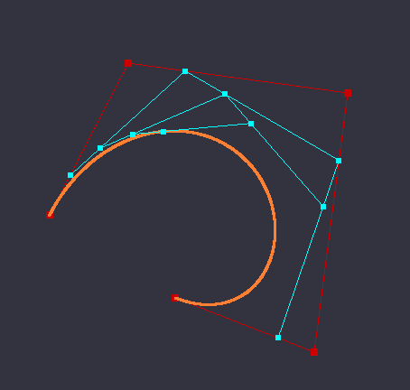
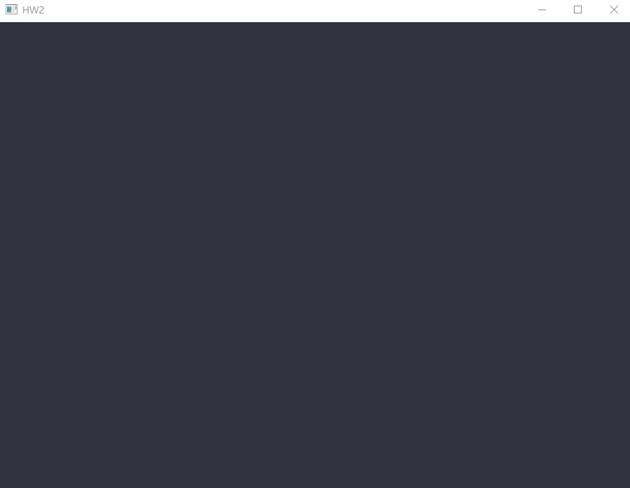
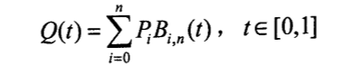
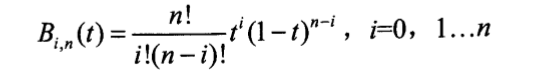

# Project8 Bezier

源代码地址：<https://github.com/T-Machine/Computer-Graphic>

## 实现内容

### Basic：

1. 用户能通过左键点击添加Bezier曲线的控制点，右键点击则对当前添加的最后一个控制点进行消除 
2. 工具根据鼠标绘制的控制点实时更新Bezier曲线。 

### Bonus：

1. 可以动态地呈现Bezier曲线的生成过程。 

## 实现效果



最多支持12个控制点。**GIF**：




## 实现原理

Bezier曲线是由调和函数根据控制点来插值生成的，其参数方程如下：



该方程中$P_i$为输入的控制点坐标向量，也就是特征多边形的顶点向量，共有n+1项。$B_{i,n}(t)$为**Bernstein**基函数，其计算方法如下：




## 实现过程

### 控制点的绘制

为使用鼠标来绘制控制点，需要获取鼠标的位置和输入，首先注册这两个事件的回调函数：

```c++
glfwSetCursorPosCallback(window, mouse_callback);
glfwSetMouseButtonCallback(window, mouseButtonCallback);
```

在`CursorPosCallback`中记录下当前光标坐标：

```c++
void mouse_callback(GLFWwindow* window, double xpos, double ypos) {
	last_mouseX = xpos;
	last_mouseY = ypos;
}
```

在`MouseButtonCallback`中，当点左键时，将光标坐标映射到标准坐标[-1, 1]上，然后生成新的控制点；点击右键时，删除最新的那个控制点:

```c++
void mouseButtonCallback(GLFWwindow* window, int button, int action, int mods) {
	if (action == GLFW_PRESS && button == GLFW_MOUSE_BUTTON_LEFT) {
		float x = last_mouseX / SCREEN_W * 2 - 1;
		float y = - (last_mouseY / SCREEN_H * 2 - 1);
		((ProjectBezier*)project)->addControlPoint(glm::vec2(x, y));
	}
	if (action == GLFW_PRESS && button == GLFW_MOUSE_BUTTON_RIGHT) {
		((ProjectBezier*)project)->deleteControlPoint();
	}
}
```

这里的控制点以两种方式存储，一种是向量形式，存储在一个vector中，用于下面Bezier曲线的计算；另一种是顶点坐标形式，存储在数组中，用于复制到VBO中进行绘制：

```c++
void ProjectBezier::addControlPoint(glm::vec2 p) {
	controlPoints.push_back(p);
	controlVertices[controlNum * 2] = p.x;
	controlVertices[controlNum * 2 + 1] = p.y;
	controlNum++;
}
```

在用`glDrawArrays`绘制时，首先使用`GL_POINTS`参数来单独绘制控制点，然后用`GL_LINE_STRIP`参数将各个点顺序连接起来：

```c++
// draw control points
glBindVertexArray(controlVAO);
myShader.setVec3("pointColor", glm::vec3(0.8, 0.0, 0.0));
if (controlNum > 0) {
	glPointSize(8);
	glDrawArrays(GL_POINTS, 0, controlNum);
}
if (controlNum > 1) {
	glDrawArrays(GL_LINE_STRIP, 0, controlNum);
}
```


### Bezier曲线的绘制

首先计算Bernstein基函数：

```c++
float ProjectBezier::Bernstein(int i, int n, float t) {
	return getFactorial(n) / (getFactorial(i) * getFactorial(n - i)) * pow(t, i) * pow(1 - t, n - i);
}
```

这里需要计算阶乘，由于int变量最多只能容下12的阶乘，所以最多支持12个控制点。为提高运行效率，这里预先将12个数的阶乘计算好存放于数组中：

```c++
int ProjectBezier::getFactorial(int n) {
	return n > 12 ? 1 : factorial[n];
}
```

最后根据基函数以及各个控制点的坐标向量计算出Bezier曲线。为了让画出的线更连贯，这里的t值以0.001递增。将计算出的点存放在数组中用于绘制：

```c++
void ProjectBezier::createBezierLine() {
	int n = controlNum - 1;
	for (float t = 0.0; t < 1.0; t += 0.001) {
		glm::vec2 p = controlPoints[0] * Bernstein(0, n, t);
		for (int i = 1; i <= n; i++) {
			p = p + controlPoints[i] * Bernstein(i, n, t);
		}
		vertices[verticesNum * 2] = p.x;
		vertices[verticesNum * 2 + 1] = p.y;
		verticesNum++;
	}
}
```


### 动态过程的绘制

为了呈现动态的绘制过程，需要在每一帧中将不同的中间辅助线绘制出来，因此可以让公式中的`t`值逐帧变化：

```c++
// draw assist lines
myShader.setVec3("pointColor", glm::vec3(0.0, 1.0, 1.0));
frame += 0.01;
frame = frame > 1 ? 0 : frame;
createAssistLines(frame);
```

对于N个初始控制点，共有N-1组辅助线。对于每一组辅助线，利用前一组的控制点坐标向量，通过两个向量的线性组合来得到中间控制点。每得到一组中间控制点都将它们绘制出来，然后计算下一组：

```c++
void ProjectBezier::createAssistLines(float t) {
	// init assistVertices
	for (int i = 0; i < controlNum * 2; i++) {
		assistVertices[i] = controlVertices[i];
	}
	for (int count = controlNum; count > 1; count--) {
		for (int i = 0; i < count - 1; i++) {
			// 利用向量计算中间点
			glm::vec2 p1 = glm::vec2(assistVertices[i * 2], assistVertices[i * 2 + 1]);
			glm::vec2 p2 = glm::vec2(assistVertices[(i+1) * 2], assistVertices[(i+1) * 2 + 1]);
			glm::vec2 P = p1 * (1 - t) + p2 * t;

			assistVertices[i * 2] = P.x;
			assistVertices[i * 2 + 1] = P.y;
		}
		drawAssistLines(count - 1);
	}
}
```