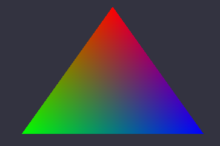

## Project 2

**最终结果：**


#### 1.使用OpenGL(3.3及以上)+GLFW或freeglut画一个简单的三角形。 

**实现效果：**


**实现过程：**

在开始绘制之前需要创建窗口，首先实例化一个GLFW窗口，使用`glfwInit`进行初始化，并用`glfwWindowHint`进行相关配置，比如当前OpenGL的版本。

```c++
glfwInit();
glfwWindowHint(GLFW_CONTEXT_VERSION_MAJOR, 3);
glfwWindowHint(GLFW_CONTEXT_VERSION_MINOR, 3);
glfwWindowHint(GLFW_OPENGL_PROFILE, GLFW_OPENGL_CORE_PROFILE);
```

然后需要创建窗口对象，使用的函数为`glfwCreateWindow`，其前两个参数指定了窗口的尺寸。创建之后需要将其上下文设置为当前线程的主上下文：

```c++
GLFWwindow* window = glfwCreateWindow(1000, 600, "LearnOpenGL", NULL, NULL);
glfwMakeContextCurrent(window);
```

接下来需要配置GLAD，用于管理OpenGl的函数指针：

```c++
gladLoadGLLoader((GLADloadproc)glfwGetProcAddress
```

进行了这些配置之后就能渲染窗口了，因为需要不断地进行渲染，故渲染的相关操作放到循环中进行，知道窗口被关闭为止。在循环渲染中，用`glfwWindowShould`判断当前的GLFW窗口是否被关闭，并通过调用`glfwSwapBuffers`来交换颜色缓冲，将要渲染的内容显示到屏幕上。

```c++
while (!glfwWindowShouldClose(window)) {
    glfwSwapBuffers(window);
}
```

渲染结束之后需要调用`glfwTerminate`来回收资源。

三角形的绘制过程在下面给出。


#### 2.对三角形的三个顶点分别改为红绿蓝

**实现效果如下：**



呈现这样的结果的原因：当给每个顶点指定不同的颜色时，片段着色器中会进行片段插值，OpenGL根据三角形内部各个像素的位置和三个顶点的颜色进行插值计算，将各个像素的颜色输入属性设为三个顶点RGB值的线性组合，因此呈现出类似调色板的结果。

**实现过程：**

**VAO与VBO**

在绘制图形时首先要给OpenGL输入顶点数据，包括顶点的位置和颜色，其中位置由三维坐标表示，颜色则由RGB值表示，它们都是范围在-1.0f和1.0f之间的浮点数，存放在一个float数组中，并按顺序排列：

```c++
float vertices[] = {
	//first triangle
	-0.8f, 0.0f, 0.0f, 0.0f, 1.0f, 0.0f,	//left down
	-0.2f, 0.0f, 0.0f, 0.0f, 0.0f, 1.0f,	//right down
	-0.5f,  0.7f, 0.0f, 1.0f, 0.0f, 0.0f	//up
}
```

其中每一行表示一个三角形顶点的数据，前三个值为空间坐标，后三个值为RGB，将三个顶点的颜色分别设为红绿蓝。

定义了这些数据之后需要将它们作为输入发送给顶点着色器，并放入顶点缓冲对象VBO中进行管理。在这之前需要先生成及配置顶点数组对象VAO，它能够存储顶点属性的配置以及相应的VBO，使得OpenGL知道如何处理这些顶点输入。首先用`glGenVertexArrays`创建VAO并用`glBindVertexArray`将其绑定：

```c++
unsigned int VAO;
glGenVertexArrays(1, &VAO);
glBindVertexArray(VAO);
```

然后需要使用`glGenBuffers`来创建VBO，并用`glBindBuffer`将其绑定到`GL_ARRAY_BUFFER`上：

```c++
unsigned int VBO;
glGenBuffers(1, &VBO);
glBindBuffer(GL_ARRAY_BUFFER, VBO);
```

接下来将之前定义的顶点数据复制到VBO中，使用的函数是`glBufferData`，其第一个参数为`GL_ARRAY_BUFFER`，由于它与刚刚创建的VBO绑定了，故`vertices`中的内容可以存储到该VBO中：

```c++
glBufferData(GL_ARRAY_BUFFER, sizeof(vertices), vertices, GL_STATIC_DRAW);
```

由于顶点数据的格式是我们自己定义的，故需要手动指定这些数据的哪一部分对应顶点着色器的哪一顶点属性。这通过`glVertexAttribPointer`函数来实现，其第一个参数指定了顶点属性的位置值，这里将坐标属性的位置值设为0，颜色属性的位置值设为1；第二个参数指定的是顶点属性的大小，这里的坐标和RGB均由三个数值组成(vec3)，故此参数设为3；接下来需要将第三个参数设置为`GL_FLOAT`来指定数据类型为浮点数，以及第四个参数`GL_FALSE`来取消数据的标准化，即保留数据的取值范围在-1.0f到1.0f 之间；剩下的两个参数分别设置的是步长和偏移量，因为每个顶点有6个数值，故步长设为6个float，前三个数值为坐标属性，故其偏移量设为0，而颜色属性的偏移量则设为3个float。

```c++
//位置属性
glVertexAttribPointer(0, 3, GL_FLOAT, GL_FALSE, 6 * sizeof(float), (void*)0);
glEnableVertexAttribArray(0);
//颜色属性
glVertexAttribPointer(1, 3, GL_FLOAT, GL_FALSE, 6 * sizeof(float), (void*)(3 * sizeof(float)));
glEnableVertexAttribArray(1);
```

**着色器**

接下来需要创建着色器来处理输入数据，这里需要用到着色器语言GLSL。首先是顶点着色器，其中`in`关键字代表的是输入的属性，即坐标和颜色，它们的location值分别与之前设置的位置值相对应。在该着色器中需要将坐标属性赋值给`gl_Position`变量，该变量的值会作为顶点着色器的输出。此外将颜色属性赋值给一个中间变量`newColor`，同样作为输出，用于将数据发送到片段着色器。

```c++
const char *vertexShaderStr = "#version 330 core\n"
"layout (location = 0) in vec3 aPos;\n"
"layout (location = 1) in vec3 aColor;\n"
"out vec3 newColor;\n"
"void main()\n"
"{\n"
"   gl_Position = vec4(aPos, 1.0);\n"
"	newColor = aColor;\n"
"}\n\0";
```

然后是片段着色器，这里将`newColor`作为输入，OpenGL就会将两个同名同类型的变量链接到一起，实现数据的发送。将`newColor`的值赋给变量`FragColor`，作为片段着色器的输出。

```c++
const char *fragmentShaderStr = "#version 330 core\n"
"out vec4 FragColor;\n"
"in vec3 newColor;\n"
"void main()\n"
"{\n"
"   FragColor = vec4(newColor, 1.0);\n"
"}\n\0";
```

编写完着色器的代码之后需要进行编译，首先用`glCreateShader`创建顶点着色器，再用`glShaderSource`将指定的GLSL代码附加到着色器上，最后调用`glCompileShader`进行编译：

```c++
unsigned int vertexShader;
vertexShader = glCreateShader(GL_VERTEX_SHADER);
glShaderSource(vertexShader, 1, &vertexShaderStr, NULL);
glCompileShader(vertexShader);
```

片段着色器的编译步骤相同，只是`glCreateShader`中的参数要改为`GL_FRAGMENT_SHADER`。

之后需要将这些着色器链接为一个着色器程序对象。调用`glCreateProgram`来创建程序对象，用`glAttachShader`将着色器附加到该程序上，最后用`glLinkProgram`将它们链接起来：

```c++
unsigned int shaderProgram;
shaderProgram = glCreateProgram();
glAttachShader(shaderProgram, vertexShader);
glAttachShader(shaderProgram, fragmentShader);
glLinkProgram(shaderProgram);
```

**绘制图形**

有了着色器程序就能够绘制图形了，在循环渲染的过程中，调用`glUseProgram`来激活着色器程序，再次绑定之前配置好的VAO，最后使用`glDrawArrays`函数，它会使用当前激活的程序，并从绑定的VAO中取出VBO及顶点数据，用来绘制图元，当我们绘制一个三角形时，将该函数第一个参数设为`GL_TRIANGLES`；第二个参数为顶点数值的起始索引，因为是第一个三角形所以设为0；最后一个参数是顶点数，设为3：

```c++
glUseProgram(shaderProgram);
glBindVertexArray(VAO);
glDrawArrays(GL_TRIANGLES, 0, 3);
```

**释放资源**

渲染结束之后需要回收资源，比如已链接的着色器，以及无用的VBO和VAO：

```c++
glDeleteShader(vertexShader);
glDeleteShader(fragmentShader);
glDeleteVertexArrays(1, &VAO);
glDeleteBuffers(1, &VBO);
```


#### 3.给上述工作添加一个GUI，里面有一个菜单栏，使得可以选择并改变三角形的颜色。

**实现效果如下：**

**实现过程：**

首先在imgui的github上下载它的源码，其中包含了许多demo，打开其中的`example_glfw_opengl3`项目即可看到相应的文件结构，将需要用到的文件导入项目中，导入后的文件结构如下：


此外还要在VS的项目属性中添加预处理定义`IMGUI_IMPL_OPENGL_LOADER_GLAD`，用于引用`glad/glad.h`库。

使用imgui时首先要进行初始化：

```c++
ImGui::CreateContext();
ImGuiIO &io = ImGui::GetIO(); (void)io;
ImGui::StyleColorsDark();
ImGui_ImplGlfw_InitForOpenGL(window, true);
ImGui_ImplOpenGL3_Init(glsl_version);
```

如何在循环渲染的过程中利用其提供的接口创建gui界面，并进行相应的逻辑处理。这里先用`ImGui::NewFrame()`创建窗口，在`ImGui::Begin()`中可以设置窗口的标题。然后用`ImGui::ColorEdit3`来放置一个颜色编辑器，该函数需要一个float数组对象的引用作为参数，用于存放相应的数值，这里可以先声明一个`ImVec4`类型的变量`myColor`，再将其转换为`float*`类型，这样在该编辑器中选择了颜色后相应的RGB值就会存储到`myColor`的x, y, z分量中，再将它们赋值到顶点数据数值中的相应元素中。由于改变了数据，故需要重新将数据复制到VBO中，因此在绘制图形前需要再次调用`glBufferData`。最后调用imgui的渲染函数来将gui界面渲染出来。

```c++
ImGui_ImplOpenGL3_NewFrame();
ImGui_ImplGlfw_NewFrame();
ImGui::NewFrame();
ImGui::Begin("Change the color of right triangle");
ImGui::ColorEdit3("Color", (float*)&myColor);
for (int i = 0; i < 3; i++) {
	vertices[18 + i * 6 + 3] = myColor.x;
	vertices[18 + i * 6 + 4] = myColor.y;
	vertices[18 + i * 6 + 5] = myColor.z;
}
ImGui::End();
......
glBufferData(GL_ARRAY_BUFFER, sizeof(vertices), vertices, GL_STATIC_DRAW);
......
ImGui::Render();
ImGui_ImplOpenGL3_RenderDrawData(ImGui::GetDrawData());
```

渲染完成后需要回收资源：

```c++
ImGui_ImplOpenGL3_Shutdown();
ImGui_ImplGlfw_Shutdown();
ImGui::DestroyContext();
```


####  4.绘制其他的图元，除了三角形，还有点、线等。 

**实现效果：**


**实现过程：**

绘制不同的图元时同样需要定义顶点数据，为了方便操作，将这些数据的格式定义为与三角形顶点相同，即三个坐标值和三个颜色值:

```c++
float vertices[] = {
    //line
	-0.8f, -0.2f, 0.0f, 1.0f, 0.0f, 0.0f,	//left
	0.8f, -0.3f, 0.0f, 1.0f, 0.0f, 0.0f,	//right
    //point
	0.0f, -0.4f, 0.0f, 1.0f, 0.0f, 0.0f,
    ......
}
```

渲染时仍使用`glDrawArrays`，只是参数不同，直线使用 `GL_LINES`，点使用`GL_POINTS`：

```c++
glDrawArrays(GL_LINES, 6, 2);
glDrawArrays(GL_POINTS, 8, 10);
```


#### 5.使用EBO(Element Buffer Object)绘制多个三角形。

**实现效果：**


**实现过程：**

首先需要定义一个索引数组，表示要渲染的三角形顶点在vertices中的顺序，这里先在vertices中添加新的三角形的顶点属性，由于有一个共有顶点，都只用定义5个顶点的数据，然后在indices数组中确定渲染的顺序：

```c++
unsigned int indices[] = { 
	3, 4, 5, // 第一个三角形
	3, 6, 7  // 第二个三角形
};
```

然后需要创建及绑定EBO对象，并将indices中的索引数据复制到EBO中，操作过程与VBO的配置相似：

```c++
unsigned int EBO;
glGenBuffers(1, &EBO);
glBindBuffer(GL_ELEMENT_ARRAY_BUFFER, EBO);
glBufferData(GL_ELEMENT_ARRAY_BUFFER, sizeof(indices), indices, GL_STATIC_DRAW);
```

在循环渲染时，将之前使用的`glDrawArrays`换为`glDrawElements`即可绘制相应的索引内容，第一个参数设置为要绘制的图元类型；第二个参数为顶点的个数，这里设为6个；最后一个参数为EBO中的偏移量，这里设为0.

```c++
glDrawElements(GL_TRIANGLES, 6, GL_UNSIGNED_INT, 0);
```

