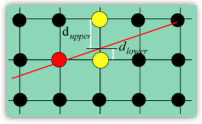
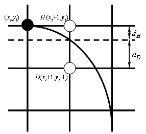
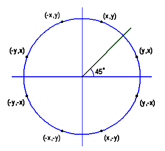
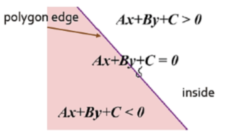
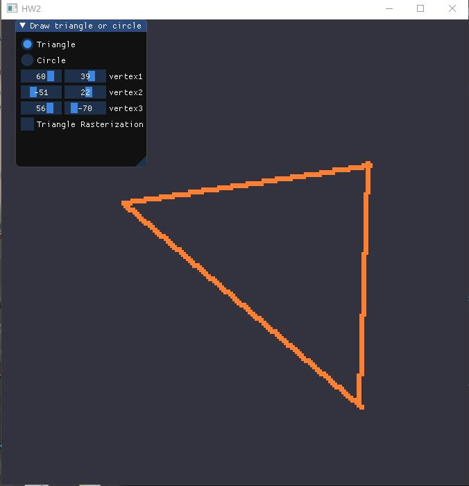
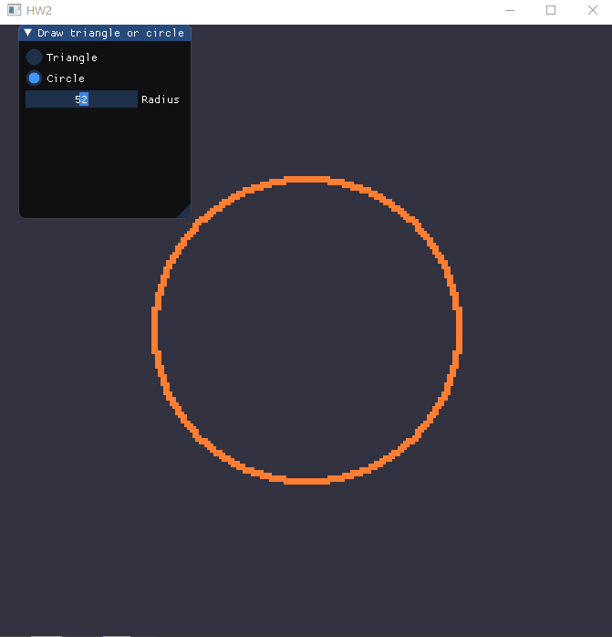
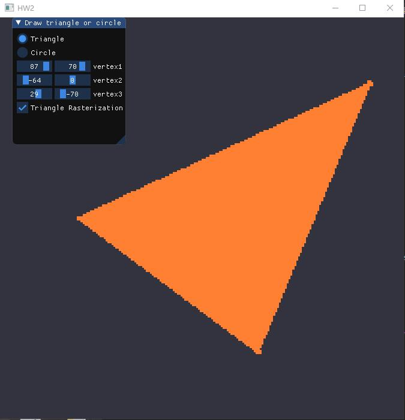

## Project 3

### 实现原理

#### Bresenham算法画直线

Bresenham算法的原理如图，对于给定的直线起点(x0, y0)，终点(x1, y1)：



其中$d_{upper} = y_i + 1 - y_{i+1} = y_i + 1 - mx_{i+1}-B$, $d_{lower}= y_{i+1} - y_i = mx_{i+1} + B - y_i $，m为斜率，B为截距。一下讨论m的绝对值小于1的情况。

当 $d_{upper}  > d_{lower} ​$时取右上方的点，否则取右边的点。可以通过做差判断：

$d_{lower} - d_{upper}= m(x_i+1)+B-y_i-(y_i+1-m(x_i+1)-B)  = 2m(x_i+1)-2y_i+2B-1​$ 

将该式乘上$\Delta x​$，符号不变：$p_i = \Delta x(d_{lower} - d_{upper}) = 2\Delta y*x_i - 2\Delta x * y_i + (2B-1)\Delta x + 2\Delta y​$

故当$p_i > 0$时取右上方的点，否则取右边的点。

因此$p_0 = 2\Delta y * x_0 - 2(\Delta y * x_0 + B * \Delta x) + (2B - 1)\Delta x + 2\Delta y= 2\Delta y - \Delta x ​$

$p_{i+1} - p_i = (2\Delta y * x_{i+1} - 2\Delta x * y_{i+1}+c) - (2\Delta y * x_i - 2\Delta x * y_i+c) = 2\Delta y - 2\Delta x(y_{i+1} - y_i)$

当$pi \leq 0​$时，取$p_{i+1} = p_i+2 \Delta y​$，当$pi < 0​$时取$p_{i+1} = p_i+2 \Delta y - 2 \Delta x​$

如此迭代，x从x0开始递增，直到x1，在第i步画出点(xi, yi)，这样就能画出一条近似的直线。


#### Bresenham算法画圆

如下图所示，在 0≤x≤y 的 1/8 圆周上，像素坐标 x 值单调增加，y 值单调减少。与画直线的方法类似，当$d_H$较小时，选择右侧的点$H(x_{i+1},y_i)$，当$d_D$较小时，选择右下方的点$H(x_{i+1},y_{i+1})$。



这里需要用到一个近似计算：

- $d_H = (x_i + 1)^2 + y^2_i - R^2$
- $d_D = R^2 - (xi + 1)^2 - (y_i - 1)^2$ 

接着可以计算判别式：$p_i = d_H - d_D = 2(x_i + 1)^2 + 2y_i^2 - 2y_i - 2R^2 + 1$

$p_{i+1} = 2(x_{i+1} + 1)^2 + 2y_{i+1}^2 - 2R^2 + 1​$

$p_{i+1} - p_i = 4x_i + 6 + 2(y^2_{i+1} - y^2_i - y_{i+1} + y_i)​$

当$pi \geq 0$时，$y{i+1} = y_i - 1$,     $p_{i+1} = p_i + 4(x_i - y_i)+10​$

当$pi < 0$时，$y{i+1} = y_i $,     $p_{i+1} = p_i + 4x_i+6$

迭代至x = y时就能画出一个八分之一圆弧。

八分法画圆：

由于圆具有八对称性，故只要画出八分之一的圆弧就能通过对称画出整个圆。设要画的点坐标为(x, y)，则其余7个与之对称的点坐标为(x, -y), (-x, y), (-x, -y), (y, x), (y, -x), (-y, x), (-y, -x)。




#### 三角形光栅化的Edge Equations方法

当给定了直线的方程`Ax + By + C = 0`，可以将任意点的坐标(x0, y0)代入来判断其在直线的那一侧：



因此对于一个三角形，当某个点的坐标代入三条边的方程后都在三角形内侧时，该点则在三角形内。为了保证三条边的内侧朝向一致，需要对它们进行中心化，其方法是对于每条边，取不在该边上的那个顶点，将该顶点的坐标代入该边的方程，如果结果小于0，则将方程中的A, B, C参数都取负。这样就能保证对于三角形内部的点，其坐标代入每条边的方程结果都为正，以此确定哪些点需要进行填充。


### 实现过程

#### 1.使用Bresenham算法(只使用integer arithmetic)画一个三角形边框：input为三个2D点；output三条直线（要 求图元只能用 GL_POINTS ，不能使用其他，比如 GL_LINES 等）。 



首先用Imgui中的滑动条来控制三个顶点的数值输入，选用`SliderInt2`控件，两个整数值分别对应顶点的x和y坐标，并设置其取值范围（与窗口大小对应）：

```c++
//三角形顶点坐标输入
int vertex1[2];
int vertex2[2];
int vertex3[2];
ImGui::SliderInt2("vertex1", vertex1, -WIN_H + 5, WIN_H - 5);
ImGui::SliderInt2("vertex2", vertex2, -WIN_H + 5, WIN_H - 5);
ImGui::SliderInt2("vertex3", vertex3, -WIN_H + 5, WIN_H - 5);
Bresenham_line(vertex1[0], vertex1[1], vertex2[0], vertex2[1], vertices, counter, WIN_W);
Bresenham_line(vertex1[0], vertex1[1], vertex3[0], vertex3[1], vertices, counter, WIN_W);
Bresenham_line(vertex2[0], vertex2[1], vertex3[0], vertex3[1], vertices, counter, WIN_W);
```

然后是使用这三组顶点数据两两组合来绘制三角形边框。首先需要一个float数组`vertices[MAX_POINT]`来存放绘制的顶点信息，用于之后的渲染。对于每组数据(x0, y0), (x1, y1)，首先判断其斜率的绝对值大小，若小于等于1，则可以按照上面的分析进行绘制；若大于1，则可以利用$x=y$这条直线作为对称轴，将x和y坐标进行调换，这样仍可以利用上面的公式进行绘制，在将绘制的结果关于$x=y$做对称变换就能画出正确的直线：

```c++
int dx = abs(x1 - x0), dy = abs(y1 - y0);
if (dy > dx) {
	flag = 1;
	swap(x0, y0);
	swap(x1, y1);
}
```

然后需要确定直线是从左往右延伸的，即根据起点和终点的横坐标大小交换它们的位置：

```c++
if (x0 > x1) {
	swap(x0, x1);
	swap(y0, y1);
}
```

接着就是按照上述的公式进行迭代，计算出每步要画的点坐标。注意这里要判断直线是向上还是向下延伸的，以此决定y坐标的变换是递增还是递减。此外OpenGL的窗口坐标是用浮点数表示的，范围从-1.0f到1.0f，因此需要对我们的整数坐标进行转换，即除以窗口大小。

```c++
dx = abs(x1 - x0);
dy = abs(y1 - y0);
int x = x0, y = y0;
int dy_2 = dy * 2;
int dx_2 = dx * 2;

int p = -dx;
while (x <= x1) {
	if (p <= 0) {
		p = p + dy_2;
	}
	else {
		if (y1 >= y0) {
			y++;
		}
		else {
			y--;
		}
		p = p + dy_2 - dx_2;
	}
	if (flag == 0) {
		vertices[counter * 2] = (float)(x + 1) / size;
		vertices[counter * 2 + 1] = (float)y / size;
	}
	else {
		vertices[counter * 2] = (float)y / size;
		vertices[counter * 2 + 1] = (float)(x + 1) / size;
	}
	counter++;
	x++;
}
```

将计算出的浮点数坐标加入`vertices`中，即可进行渲染：

```c++
//绘制图形
glBindVertexArray(VAO);
//重新将顶点数据复制到缓存
glBufferData(GL_ARRAY_BUFFER, sizeof(vertices), vertices, GL_STATIC_DRAW); 
glDrawArrays(GL_POINTS, 0, counter);
glfwSwapBuffers(window);
```


#### 2.使用Bresenham算法(只使用integer arithmetic)画一个圆：input为一个2D点(圆心)、一个integer半径； output为一个圆。



同样使用滑动条来控制圆的半径输入：

```c++
ImGui::SliderInt("Radius", &radius, 0, WIN_H - 5);
Bresenham_circle(radius, vertices, counter, WIN_H);
```

要绘制的第一个点为(0, r)，然后按上述公式进行迭代，每一步中都用八分法确定其他7个对称点。

```c++
int x = 0, y = r;
int p = 3 - 2 * r;

while (x <= y) {
	draw_circle_8(x, y, vertices, counter, size);
	if (p < 0) {
		p += 4 * x + 6;
	}
	else {
		p += 4 * (x - y) + 10;
		y--;
	}
	x++;
}
```

使用八分法确定对称点的坐标后将它们加入到`vertices`中用于渲染：

```c++
void draw_circle_8(int x, int y, float* vertices, int &counter, int size) {
	int counter_2 = counter * 2;
	vertices[counter_2] = (float)x / size;
	vertices[counter_2 + 1] = (float)y / size;
	vertices[counter_2 + 2] = (float)x / size;
	vertices[counter_2 + 3] = -(float)y / size;
	vertices[counter_2 + 4] = -(float)x / size;
	vertices[counter_2 + 5] = (float)y / size;
	vertices[counter_2 + 6] = -(float)x / size;
	vertices[counter_2 + 7] = -(float)y / size;

	vertices[counter_2 + 8] = (float)y / size;
	vertices[counter_2 + 9] = (float)x / size;
	vertices[counter_2 + 10] = (float)y / size;
	vertices[counter_2 + 11] = -(float)x / size;
	vertices[counter_2 + 12] = -(float)y / size;
	vertices[counter_2 + 13] = (float)x / size;
	vertices[counter_2 + 14] = -(float)y / size;
	vertices[counter_2 + 15] = -(float)x / size;
	counter += 8;
}
```


#### 3.在GUI在添加菜单栏，可以选择是三角形边框还是圆，以及能调整圆的大小(圆心固定即可)。 

使用`RadioButton`控件来控制画圆还是画三角，该控件可以绑定一个整数来判断当前选择的是哪个选项：

```c++
int show_what = 0;
ImGui::RadioButton("Triangle", &show_what, 0);
ImGui::RadioButton("Circle", &show_what, 1);
if (show_what == 0) {
    ......//画三角
    ImGui::Checkbox("Triangle Rasterization", &show_Rasterization);
}
else if(show_what == 1) {    
    ImGui::SliderInt("Radius", &radius, 0, WIN_H - 5);
    ......//画圆
}
```


#### 4.使用三角形光栅转换算法，用和背景不同的颜色，填充你的三角形。



首先定义一个结构体用于表示直线方程，并定义一个构造函数，用于根据输入的两点坐标来计算方程中的参数，其中$A = y2 - y1, \ B = x1 - x2, \ C = x2 * y1 - x1 * y2$

``` c++
struct Line {
	int A, B, C;
	Line(int x1, int y1, int x2, int y2) {
		A = y2 - y1;
		B = x1 - x2;
		C = x2 * y1 - x1 * y2;
	}
};
```

为了避免不必要的遍历，根据顶点坐标来确定包含三角形的最小矩形范围，然后对每条边的直线方程进行中心化：

```c++
vector<Line> Lines;
int max_x = max(x0, max(x1, x2));
int max_y = max(y0, max(y1, y2));
int min_x = min(x0, min(x1, x2));
int min_y = min(y0, min(y1, y2));
Lines.push_back(Line(x0, y0, x1, y1));
Lines.push_back(Line(x1, y1, x2, y2));
Lines.push_back(Line(x0, y0, x2, y2));

centerlize_line(Lines[0], x2, y2);
centerlize_line(Lines[1], x0, y0);
centerlize_line(Lines[2], x1, y1);
```

中心化的操作：将目标点坐标代入直线方程判断结果是否小于0，将小于0的直线方程中的参数全部取负。

```c++
void centerlize_line(Line &L, int x, int y) {
	if (L.A * x + L.B * y + L.C < 0) {
		L.A = -L.A;
		L.B = -L.B;
		L.C = -L.C;
	}
}
```

遍历范围内的所有点，将其坐标代入每条边的方程，若全都不小于0，则该点为三角形内部的点，加入`vertices`中，这样就能填充整个三角形。

```c++
for (int x = min_x; x <= max_x; x++) {
	for (int y = min_y; y <= max_y; y++) {
		bool inside = true;
		for (int i = 0; i < 3; i++) {
			if (Lines[i].A * x + Lines[i].B * y + Lines[i].C < 0) {
				inside = false;
				break;
			}
		}
		if (inside) {
			vertices[counter * 2] = (float)x / size;
			vertices[counter * 2 + 1] = (float)y / size;
			counter++;
		}
	}
}
```


